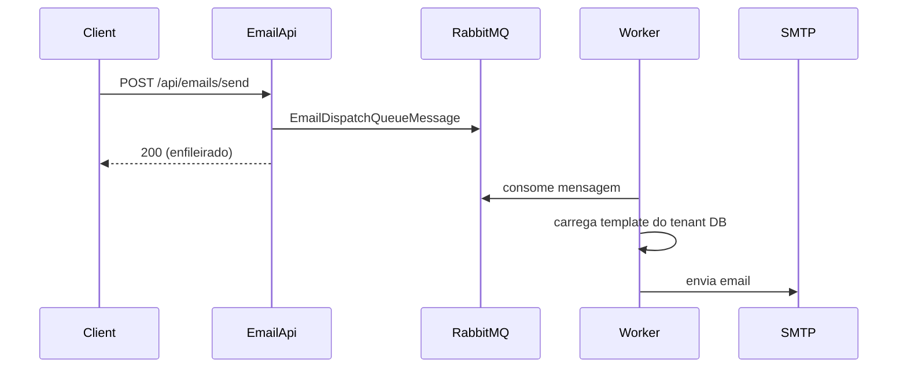

# Lightcode.Registration.EmailApi

API dedicada à gestão de **templates de email** e **enfileiramento de envios** por tenant. Os emails são processados de forma assíncrona pelo [Worker](../Lightcode.Registration.Worker/README.md) via RabbitMQ.

## Pré-requisitos

- [.NET 10 SDK](https://dotnet.microsoft.com/download)
- MongoDB
- RabbitMQ

```bash
docker compose up -d mongo rabbitmq
```

A API principal deve estar configurada com o mesmo `Jwt:SigningKey` para validar tokens emitidos por `/api/auth/token`.

## Executar

```bash
dotnet run --project Lightcode.Registration.EmailApi/Lightcode.Registration.EmailApi.csproj --launch-profile http
```

| Ambiente | URL |
|----------|-----|
| Development (HTTP) | http://localhost:5013 |
| Development (HTTPS) | https://localhost:7036 |
| Docker Compose | http://localhost:8081 |

## Autenticação

Todos os endpoints exigem **JWT Bearer** com claim `tenantId`.

Obter token na API principal:

```http
POST http://localhost:5012/api/auth/token
X-Tenant-Id: {tenantId}
Content-Type: application/json

{
  "grant_type": "client_credentials",
  "client_id": "client_{tenantId}",
  "client_secret": "{secret}"
}
```

### Permissões

| Permissão | Role | Scope alternativo |
|-----------|------|-------------------|
| Leitura de templates | `template-read` | `email-admin` |
| Escrita de templates | `template-write` | `email-admin` |
| Envio de emails | `send-email` | `email-admin` |

O scope `owner` do cliente OAuth principal concede acesso total.

## Endpoints

### Templates (`/api/email-templates`)

| Método | Rota | Permissão | Descrição |
|--------|------|-----------|-----------|
| GET | `/api/email-templates` | `template-read` | Listar templates do tenant |
| GET | `/api/email-templates/{id}` | `template-read` | Obter por id MongoDB |
| POST | `/api/email-templates` | `template-write` | Criar template |
| PUT | `/api/email-templates/{id}` | `template-write` | Atualizar |
| DELETE | `/api/email-templates/{id}` | `template-write` | Apagar |

Templates ficam no banco do tenant (`tenant_{id}.EmailTemplates`). Chave única por `Key` (ex.: `password-reset-link`, `email-confirmation-code`).

Placeholders no corpo usam `{{nome}}` (ex.: `{{username}}`, `{{resetLink}}`).

### Envio (`/api/emails`)

| Método | Rota | Permissão | Descrição |
|--------|------|-----------|-----------|
| POST | `/api/emails/send` | `send-email` | Enfileira envio (não envia SMTP diretamente) |

Corpo (`SendEmailRequest`):

```json
{
  "to": "destinatario@example.com",
  "templateKey": "password-reset-link",
  "parameters": {
    "resetLink": "https://..."
  }
}
```

Use `templateId` **ou** `templateKey`, não ambos.

## Fluxo de envio



A API principal também publica na mesma fila (provisionamento, confirmação de email, forgot-password).

## Configuração (`appsettings.json`)

| Secção | Descrição |
|--------|-----------|
| `Mongo:*` | Ligação e banco master |
| `Jwt:SigningKey` | **Deve coincidir** com a API principal |
| `RabbitMQ:*` | Fila de dispatch de emails |
| `TenantDefaultSmtp` | Referência para seed de tenants (envio real é SMTP do tenant no Worker) |

## Testes com Bruno

Coleção: [`bruno/Lightcode.Registration.EmailApi`](../bruno/Lightcode.Registration.EmailApi)

Ambiente: `environments/LOCAL.bru` (`baseUrl: http://localhost:5013`)

1. Obter JWT na API principal (`bruno/Lightcode.Registration`)
2. **List** / **Create** / **Update** templates
3. **Send** — requer Worker a correr para entrega efectiva

## Projetos relacionados

| Projeto | Função |
|---------|--------|
| [Lightcode.Registration](../Lightcode.Registration/README.md) | Auth, contas, tenants |
| [Lightcode.Registration.Worker](../Lightcode.Registration.Worker/README.md) | Envio SMTP e consumo da fila |
