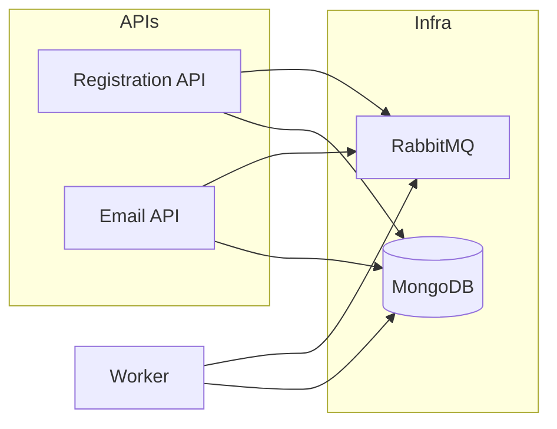

# Lightcode.Registration.Worker

Serviço em background (`IHostedService`) que processa filas RabbitMQ e tarefas agendadas: **envio de emails**, **lembretes de expiração** e **scan de cadastros expirados**.

Não expõe HTTP — corre como `Worker Service` (.NET Generic Host).

## Pré-requisitos

- [.NET 10 SDK](https://dotnet.microsoft.com/download)
- MongoDB
- RabbitMQ

```bash
docker compose up -d mongo rabbitmq
```

Para envio real de email, configure `Smtp:UseSmtp: true`. As credenciais usadas no envio ficam por tenant em `tenant_{id}.Settings` (`_id=smtp`); `TenantDefaultSmtp:*` apenas semeia esse documento na criacao de novos tenants.

## Executar

```bash
dotnet run --project Lightcode.Registration.Worker/Lightcode.Registration.Worker.csproj
```

Em Docker Compose o serviço `worker` arranca automaticamente com `Mongo__ConnectionString` e `RabbitMQ__HostName=rabbitmq`.

## Serviços em execução

| Hosted Service | Função |
|----------------|--------|
| `EmailDispatchConsumerHostedService` | Consome fila de emails; resolve template no tenant DB; envia via SMTP |
| `RegistrationExpiryScanHostedService` | Percorre tenants ativos; marca contas com registo expirado |
| `RegistrationExpiryReminderConsumerHostedService` | Consome fila de lembretes (30/15 dias antes da expiração) |

### Email dispatch

Mensagens publicadas por:

- **API principal** — onboarding do tenant, confirmação de email, forgot-password
- **EmailApi** — `POST /api/emails/send`
- **OAuthClientAppService** — reenvio de credenciais

Fluxo:

1. Mensagem `EmailDispatchQueueMessage` (JSON) na fila RabbitMQ
2. Worker carrega template por `templateKey` ou `templateId` em `tenant_{id}.EmailTemplates`
3. Merge de placeholders `{{chave}}`
4. SMTP do tenant (`Settings`, `_id=smtp`)

Com `Smtp:UseSmtp: false` (default em dev), os emails são apenas registados em log (`LoggingOutboundMailSender`).

### Expiração de cadastros

O scan usa o schema default (`AccountJsonSchemas`) de cada tenant para ler regras de `config.expiry`. Intervalo configurável em `RabbitMQ:ScanIntervalMinutes`.

## Configuração (`appsettings.json`)

| Secção | Descrição |
|--------|-----------|
| `Mongo:ConnectionString` | Ligação MongoDB |
| `Mongo:MasterDatabaseName` | Banco master (`SaasMasterDb`) |
| `Jwt:SigningKey` | Usado internamente onde necessário |
| `RabbitMQ:HostName` | Host RabbitMQ (`localhost` ou `rabbitmq` no Docker) |
| `RabbitMQ:ScanIntervalMinutes` | Intervalo do scan de expiração (default: 360) |
| `Smtp:UseSmtp` | `true` = envio SMTP real usando `tenant_{id}.Settings`; `false` = apenas log |

Exemplo Docker / produção:

```env
Mongo__ConnectionString=mongodb://mongo:27017
RabbitMQ__HostName=rabbitmq
Smtp__UseSmtp=true
TenantDefaultSmtp__Host=smtp.gmail.com
TenantDefaultSmtp__Port=587
TenantDefaultSmtp__Usuario=contato@example.com
TenantDefaultSmtp__Senha=app-password-do-provedor
TenantDefaultSmtp__EmailRemetente=contato@example.com
TenantDefaultSmtp__NomeRemetente=Lightcode
TenantDefaultSmtp__UsarSsl=true
```

Para Gmail, use uma **App Password** da conta Google. A senha normal da conta costuma falhar com `5.7.0 Authentication Required`, mesmo com usuario e remetente corretos.

## Dependências da stack completa



Para testar **forgot-password**, **confirmação de email** ou **Send** na EmailApi, o Worker **deve** estar a correr.

## Arranque com retry RabbitMQ

O Worker tenta ligar ao RabbitMQ até 45 vezes (intervalo de 2 s) antes de falhar — útil quando o container RabbitMQ ainda está a inicializar.

## Projetos relacionados

| Projeto | Função |
|---------|--------|
| [Lightcode.Registration](../Lightcode.Registration/README.md) | Publica mensagens de email; páginas de reset |
| [Lightcode.Registration.EmailApi](../Lightcode.Registration.EmailApi/README.md) | Enfileira envios via API |
